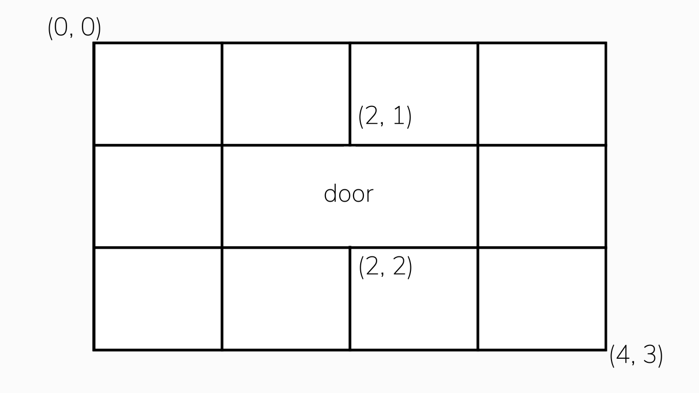

# Munakata and Doors
Kyosuke Munakata is hunting down Makoto Naegi for his acts of treason! However, his NG code prevents him from opening any doors. Munakata is located at point (0, 0) on the grid, and Naegi at (*M*, *N*). Assuming he can only travel east and south, he wants to know the amount of ways he can get to Naegi. He has memorized the layout of the floor he and Naegi are currently in, and knows that there is a door positioned between (a, b) and (c, d). Given a grid with a size of *M* by *N*, write a program that determines the number of ways that Munakata can get to Naegi while avoiding the door.

**Diagram illustrating Sample Input 1:**


## Input Specification
The first line of input will contain two integers, *M* and *N* (2<=M, N<=25), representing the x and y coordinates of Naegi, respectievly.
The second line of input will contain four integers, representing a, b, c, and d (2<=a, c<=M, 2<=b, d<=N), respectively.

## Output Specification
The output should contain one integer, representing the number of pathways Munakata can take to get to Naegi while avoiding the door.

## Sample Input
```
4 3
2 1 2 2
```

## Sample Output
```
26
```